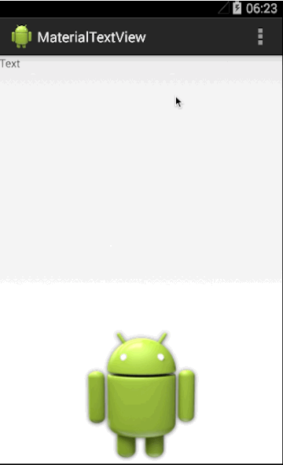
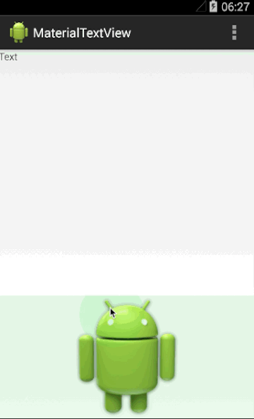

#MaterialView
##Introduce
This project is build to let the view looks like a material design widget when touched.

You can contact with we via email: **<kifile@kifile.com>**
##Preview

##Dependences
com.nineoldandroids:library:2.4.0

##Including In Your Project
	dependencies {
    	compile 'com.kifile:MaterialView:1.0'
	}

##How To Use
###1.Extends your target view.
	public class MaterialImageView extends ImageView {
		public MaterialImageView(Context context) {
        	super(context);
        	init(null, 0);
    	}

    	public MaterialImageView(Context context, AttributeSet attrs) {
        	super(context, attrs);
        	init(attrs, 0);
    	}

    	public MaterialImageView(Context context, AttributeSet attrs, int defStyle) {
        	super(context, attrs, defStyle);
        	init(attrs, defStyle);
    	}
	}
###2.Create a MaterialBackgroundDetector in your initial code.
	private MaterialBackgroundDetector mDetector;
	
	private void init(AttributeSet attrs, int defStyle) {
        final TypedArray a = getContext().obtainStyledAttributes(
                attrs, com.kifile.materialwidget.R.styleable.MaterialTextView, defStyle, 0);
        int color = a.getColor(com.kifile.materialwidget.R.styleable.MaterialTextView_maskColor, MaterialBackgroundDetector.DEFAULT_COLOR);
        a.recycle();
        mDetector = new MaterialBackgroundDetector(getContext(), this, null, color);
    }
###3.Handle the relative event in your code.
	@Override
    protected void onSizeChanged(int w, int h, int oldw, int oldh) {
        super.onSizeChanged(w, h, oldw, oldh);
        mDetector.onSizeChanged(w, h);
    }

    @Override
    public boolean onTouchEvent(MotionEvent event) {
        boolean superResult = super.onTouchEvent(event);
        return mDetector.onTouchEvent(event, superResult);
    }

    @Override
    protected void onDraw(Canvas canvas) {
        super.onDraw(canvas);
        if (isInEditMode()) {
            return;
        }
        mDetector.draw(canvas);
    }
###4.(Optional) Handle click event.
Through the above code, you have realized the view. But there is still some little problems.
When you click the view to jump to another activity, you may not see the whole mask animation.

To resolve this problem, the detector handle the click event, and response the event after animation.

You should add these codes to your view.

In your initial code, you should transfer a Callback object in MaterialBackground constructor.

	mDetector = new MaterialBackgroundDetector(getContext(), this, this, color);
The second this means this view implements a Callback interface.
Then you shuould add these code:

	@Override
    public boolean performClick() {
        return mDetector.handlePerformClick();
    }

    @Override
    public boolean performLongClick() {
        return mDetector.handlePerformLongClick();
    }

    @Override
    public void performClickAfterAnimation() {
        super.performClick();
    }

    @Override
    public void performLongClickAfterAnimation() {
        super.performLongClick();
    }
    
You can see the example view named MaterialTextView and MaterialImageView in the app module for more details.

##About proguard
If you want to use proguard,  you should add these code in your proguard file:

    -keep class com.kifile.materialwidget.MaterialBackgroundDetector {
        public void setRadius(...);
        public void setAlpha(...);
    }
    
##Developed By
* Kifile Chou - <kifile@kifile.com>

##Listense
	Copyright 2015 kifile

	Licensed under the Apache License, Version 2.0 (the "License");
	you may not use this file except in compliance with the License.
	You may obtain a copy of the License at

    	http://www.apache.org/licenses/LICENSE-2.0

	Unless required by applicable law or agreed to in writing, software
	distributed under the License is distributed on an "AS IS" BASIS,
	WITHOUT WARRANTIES OR CONDITIONS OF ANY KIND, either express or implied.
	See the License for the specific language governing permissions and
	limitations under the License.